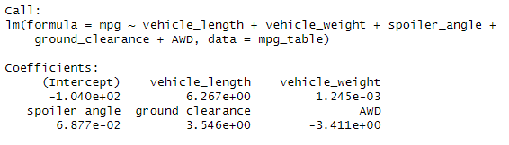
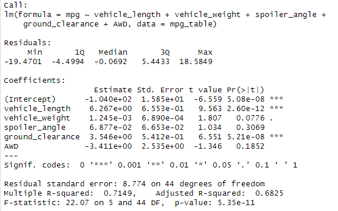
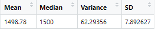
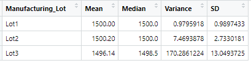
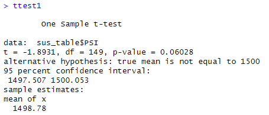
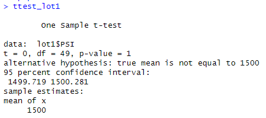
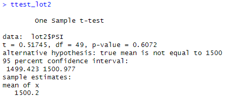
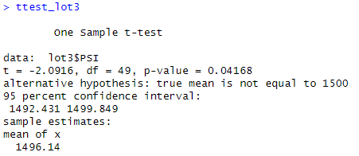

# MechaCar_Statistical_Analysis

## Linear Regression to Predict MPG

1) Which variables/coefficients provided a non-random amount of variance to the mpg values in the dataset?

The vehicle length and ground clearance have a statistically signifanct impact on the variance of the mpg values in the data set. As can be seen from the Multiple Linear Regression Model Summary Statistics, both the Pr(>|t|) for vehicle length and ground clearance are extremely low probability values, less than 0.001%. This  means it is highly unlikely that each coefficient contributes a random amount of variance to the linear model.

2) Is the slope of the linear model considered to be zero? Why or why not?

The hypothesese are as follows: 

Null Hypothesis (H0) : The slope of the linear model is zero, or m = 0

Alternative Hypothesis (Ha) : The slope of the linear model is not zero, or m ≠ 0

Test as a signifcance level of 0.05%. 

From the Mulitple Linear Regression Model Summary Statistics, it can be seen that the p-value of our linear regression analysis is 5.35 x 10-11, which is much smaller than a significance level of 0.05%. There is sufficient evidence to reject the null hypothesis, which means that the slope of the linear model is not zero.

3) Does this linear model predict mpg of MechaCar prototypes effectively? Why or why not?

From the Mulitple Linear Regression Model Summary Statistics, the r-squared value is 0.7149. An r-squared value of 0.7 or higher is generally a good predictor of how well the model will approximate real world data points. This, combined with the statistically significant p-value, shows it can be used to predict mpg of MechaCar prototypes effectively. However, the intercept is also statistically significant. This means there are other variables and/or factors that contribute to the variation in mpg that are not captured in this linear regression model. More analysis should be completed to see if the dataset holds the necessary information to explain or not explain this variance. 

## Summary Statistics on Suspension Coils

The design specifications for the MechaCar suspension coils dictate that the variance of the suspension coils must not exceed 100 pounds per square inch. From the total summary, where it is not broken down by lots, the variance across all lots is 62.29 which meets the design criteria. However, when grouped by each individual lot, Lot 3 does not meet this criteria. Lot 1 and 2 have variances less than 100 at 0.98 and 7.46, respectively, but Lot 3 has a variance of 170.29. 

## T-Tests on Suspension Coils

Four t-tests were performed: 
    1) Test if the PSI across all manufacturing lots is statistically different from the population mean of 1,500 pounds per square inch.

    2) Test if the PSI from Lot 1 is statistically different from the population mean of 1,500 pounds per square inch.

    3) Test if the PSI from Lot 2 is statistically different from the population mean of 1,500 pounds per square inch.

    4) Test if the PSI from Lot 3 is statistically different from the population mean of 1,500 pounds per square inch.

In all tests a significance value of 0.05 was used and the null and alterantive hypothesis were as follows: 

H0 : There is no statistical difference between the observed sample mean and its presumed population mean.
Ha : There is a statistical difference between the observed sample mean and its presumed population mean.

After performing a one sample t-test, the p-value is 0.068 which is larger than the significant value of 0.05. There is insufficient evidence to reject the null hypothesis, meaning there is no statistical difference between the mean PSI from all the lots and the population mean. 

After performing a one sample t-test, the p-value is 1 which is larger than the significant value of 0.05. There is insufficient evidence to reject the null hypothesis, meaning there is no statistical difference between the mean PSI from Lot 1 and the population mean. 

After performing a one sample t-test, the p-value is 0.61 which is larger than the significant value of 0.05. There is insufficient evidence to reject the null hypothesis, meaning there is no statistical difference between the mean PSI from Lot 2 and the population mean. 

After performing a one sample t-test, the p-value is 0.042 which is smaller than the significant value of 0.05. There is sufficient evidence to reject the null hypothesis, meaning there is a statistical difference between the mean PSI from Lot 3 and the population mean. 

## Study Design: MechaCar vs Competition